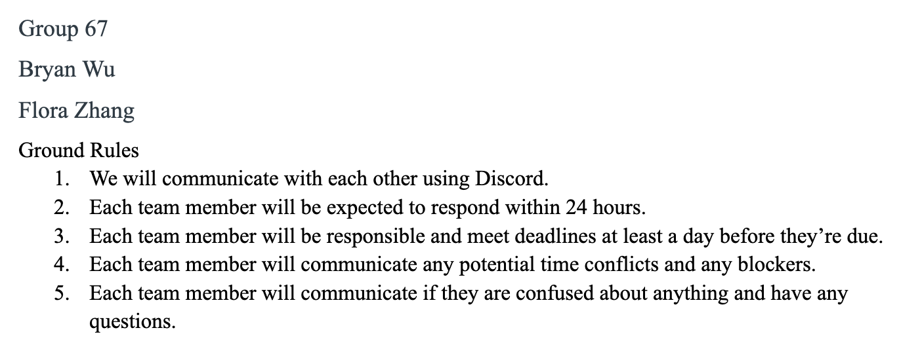
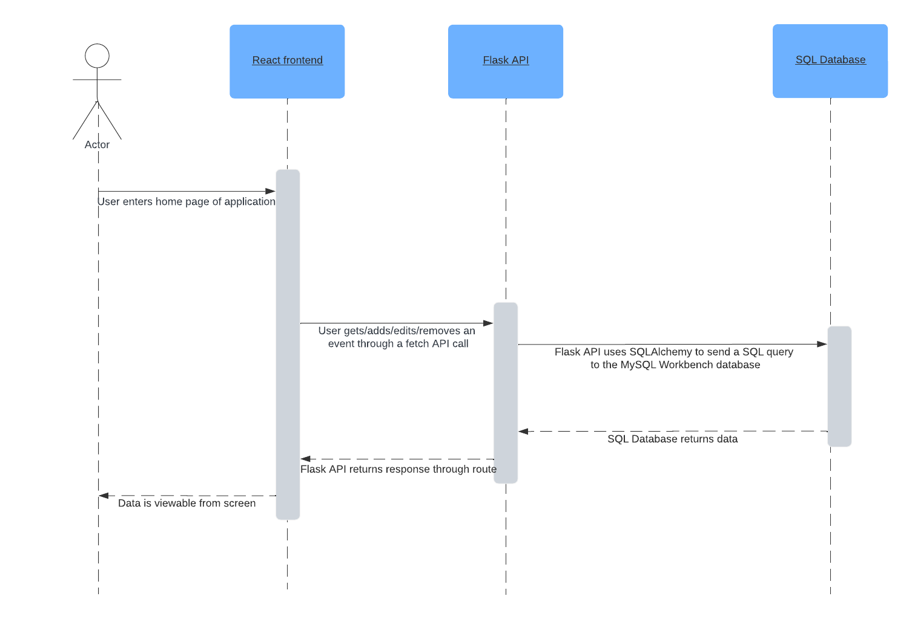

# Choose4me microservice

## Communication Contract



## Tech Stack

- Flask
- SQLAlchemy
- MySQL (MySQLWorkbench)

## How to request data

In order to request data, the Flask API must be running. To do this, run `python server.py` in the terminal in the folder containing `server.py`. The SQL database also has to be running, so be sure to have MySQL Workbench open so that requests can be made.

Once the servers are set up, add the following key-value pair in the package.json file in the frontend:
`"proxy": http://localhost:8080`

Now, in the frontend itself, the request can be made with a command similar to this:

```
  const fetchData = async () => {
    await fetch("/get-adventures").then((data) => {
      console.log(data.json());
    });
  };
```

The URL within the fetch function corresponds to the routes in the Flask API. For example, the current routes are `/get-adventures`, `/add-adventures/<adventure_name>`, and `/remove-adventures/<int:id>`.

The `/get-adventures` route, for example, corresponds to this route in `server.py`:

```
@app.route("/get-adventures")
def get_adventures():
    adventures = db.session.execute(db.select(Main)).scalars()
    current_adventures = []
    for row in adventures:
        current_adventures.append({"id": row.id, "name": row.name, "date": row.date})
    return {"response": current_adventures}
```

## How to receive data

Receiving data is pretty much already built into the Fetch API. Currently, the Flask API already returns the response from the SQL Database. Using this part of the fetch command, 
```
    await fetch("/get-adventures").then((data) => {
      console.log(data.json());
    });
```
```data``` is being returned from the route and can be converted in the frontend to a JSON, or however you see fit.

## UML Sequence Diagram


The UML diagram shows the workflow of a user interacting with the frontend and the different calls that are made to connect the different participants. 